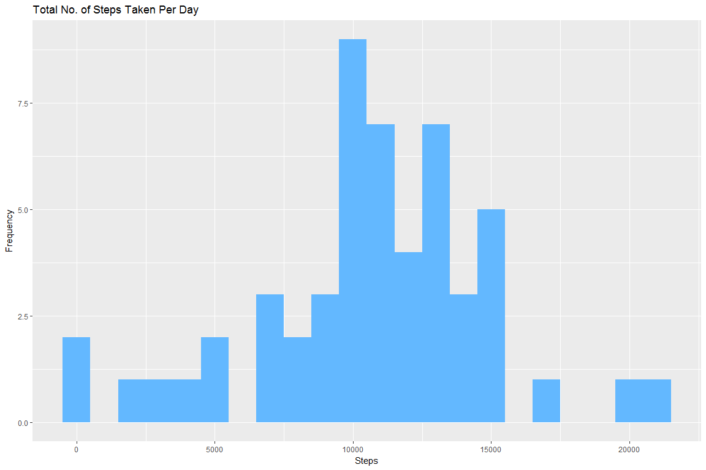
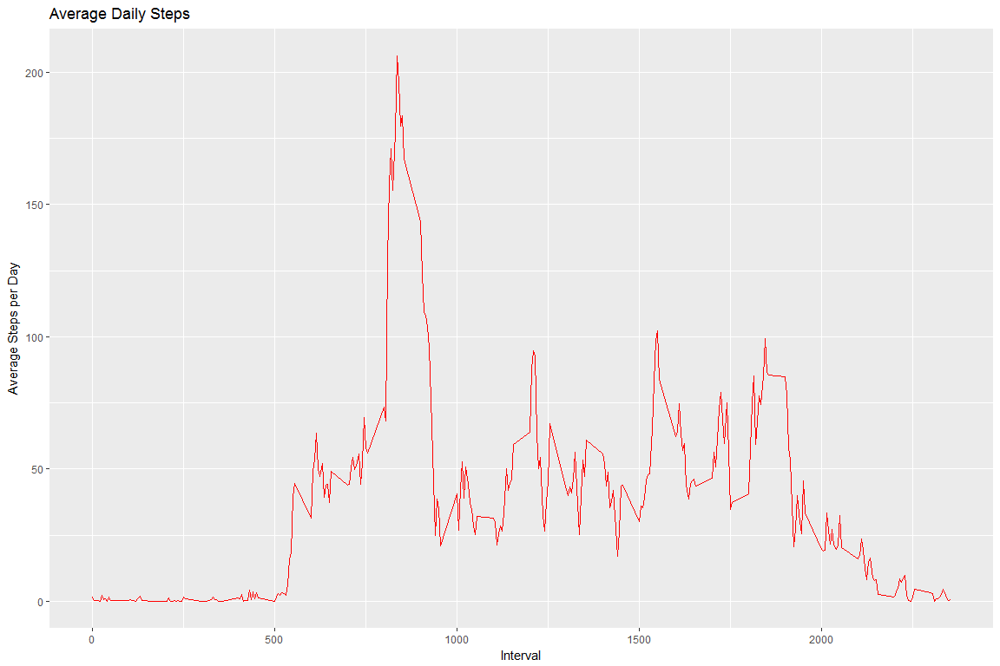
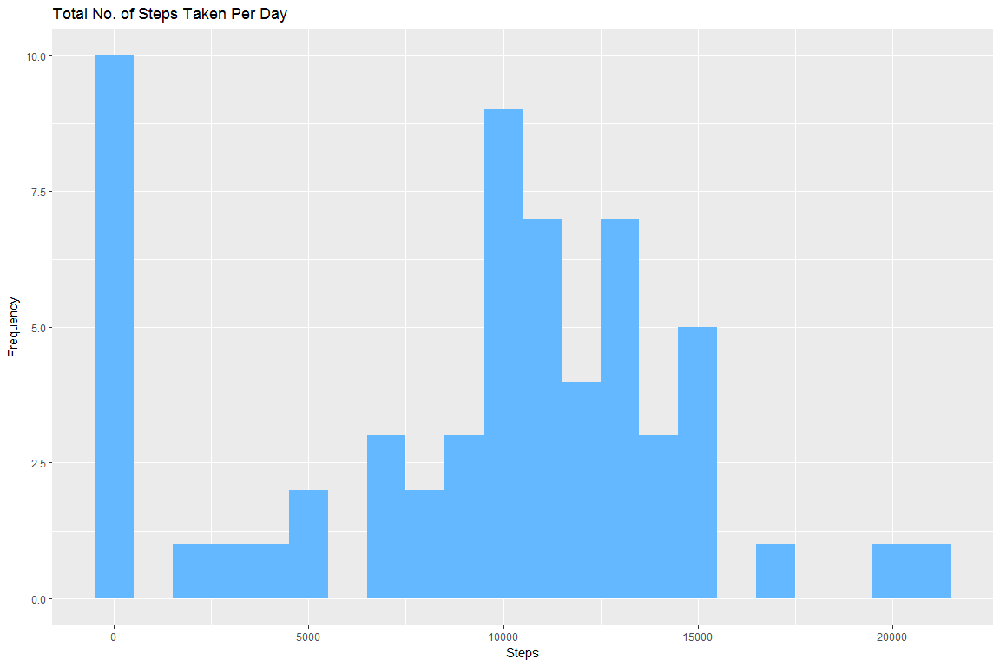
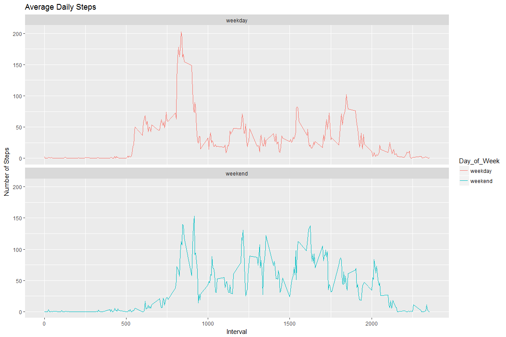

## Loading and preprocessing the data

```r
packages <- c("dplyr", "ggplot2")
sapply(packages, require, character.only=TRUE, quietly=TRUE)
```

```
##   dplyr ggplot2 
##    TRUE    TRUE
```

```r
unzip(zipfile = "activity.zip")
data <- read.csv("activity.csv")
```


## What is mean total number of steps taken per day?

1. Total number of steps per day

```r
data_by_date <- data %>% group_by(date) %>% 
  summarise(total_steps = sum(steps, na.rm = FALSE))
```

2. Histogram of the total number of steps taken per day

```r
data_by_date %>% ggplot(aes(x = total_steps)) + 
  geom_histogram(fill = "steelblue1", binwidth = 1000) +
  labs(title = "Total No. of Steps Taken Per Day", x = "Steps", y = "Frequency")
```

<!-- -->

3. Mean & Median of the total number of steps taken per day

```r
data.frame(Mean_Steps = mean(data_by_date$total_steps, na.rm = TRUE), Median_Steps = median(data_by_date$total_steps, na.rm = TRUE))
```

```
##   Mean_Steps Median_Steps
## 1   10766.19        10765
```


## What is the average daily activity pattern?

1. Make a time series plot (i.e. type = "l") of the 5-minute interval (x-axis) and the average number of steps taken, averaged across all days (y-axis)

```r
data_by_interval <- data %>% filter(complete.cases(steps)) %>%
  group_by(interval) %>%
  mutate(ave_steps = mean(steps))

data_by_interval %>%
  ggplot(aes(x = interval, y = ave_steps)) + geom_line(color="red") +
  labs(title = "Average Daily Steps", x = "Interval", y = "Average Steps per Day")
```

<!-- -->

2. Which 5-minute interval, on average across all the days in the dataset, contains the maximum number of steps?

```r
data_by_interval %>% summarise(max_steps = max(ave_steps)) %>%
  arrange(desc(max_steps))
```

```
## # A tibble: 288 x 2
##    interval max_steps
##       <int>     <dbl>
##  1      835       206
##  2      840       196
##  3      850       183
##  4      845       180
##  5      830       177
##  6      820       171
##  7      855       167
##  8      815       158
##  9      825       155
## 10      900       143
## # ... with 278 more rows
```


## Imputing missing values

1. Calculate and report the total number of missing values in the dataset (i.e. the total number of rows with NAs)

```r
sum(!complete.cases(data))
```

```
## [1] 2304
```

2. Devise a strategy for filling in all of the missing values in the dataset. The strategy does not need to be sophisticated. For example, you could use the mean/median for that day, or the mean for that 5-minute interval, etc.

```r
impute <- data$steps
impute[is.na(impute)] <- median(data$steps, na.rm = TRUE)
data$steps <- impute
```

3. Create a new dataset that is equal to the original dataset but with the missing data filled in.

```r
data.table::fwrite(data, file = "activity_Imputed.csv")
```

4. Make a histogram of the total number of steps taken each day and Calculate and report the mean and median total number of steps taken per day. Do these values differ from the estimates from the first part of the assignment? What is the impact of imputing missing data on the estimates of the total daily number of steps?

```r
data_by_date <- data %>% group_by(date) %>% 
  summarise(total_steps = sum(steps, na.rm = TRUE))

data_by_date %>% ggplot(aes(x = total_steps)) + 
  geom_histogram(fill = "steelblue1", binwidth = 1000) +
  labs(title = "Total No. of Steps Taken Per Day", x = "Steps", y = "Frequency")
```

<!-- -->

```r
data.frame(Mean_Steps = mean(data_by_date$total_steps, na.rm = TRUE), Median_Steps = median(data_by_date$total_steps, na.rm = TRUE))
```

```
##   Mean_Steps Median_Steps
## 1    9354.23        10395
```

## Are there differences in activity patterns between weekdays and weekends?

1. Create a new factor variable in the dataset with two levels - "weekday" and "weekend" indicating whether a given date is a weekday or weekend day.

```r
week_days <- c("Monday", "Tuesday", "Wednesday", "Thursday", "Friday")
data2<-data %>% 
  mutate(Day_of_Week = ifelse(weekdays(as.Date(data$date)) %in% week_days, "weekday", "weekend"))
```

2. Make a panel plot containing a time series plot (i.e. type = "l") of the 5-minute interval (x-axis) and the average number of steps taken, averaged across all weekday days or weekend days (y-axis). See the README file in the GitHub repository to see an example of what this plot should look like using simulated data.

```r
data_by_interval2 <- data2 %>%
  group_by(interval, Day_of_Week) %>%
  mutate(ave_steps = mean(steps))

data_by_interval2 %>%
  ggplot(aes(x = interval, y = ave_steps)) + geom_line(aes(color = Day_of_Week)) + 
  facet_wrap(~Day_of_Week, nrow = 2) + 
  labs(title = "Average Daily Steps", x = "Interval", y = "Number of Steps")
```

<!-- -->
